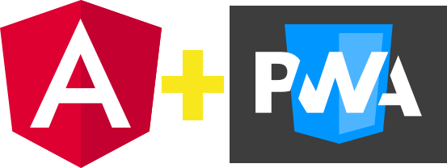

# WORKSHOP

    

## PWA Aplicaciones Web Progresivas

### [**Configuraciones necesarias**](0-configuraciones-necesarias/0-configuraciones-necesarias.md)

- NodeJS
- Angular
- PouchDb
- Visual Studio Code
- Git

### [**¿Qué es una PWA?**](1-pruebas-automaticas/1-1-pruebas-automaticas.md)

Es una solución basada en la web tradicional que todos conocemos, aunque incorpora algunas particularidades que la hacen parecerse a una app nativa para teléfonos móviles y tabletas.

Requisitos Mínimos para que una aplicación sea PWA

- [Manifiesto de la aplicación](1-pruebas-automaticas/1-1-pruebas-automaticas.md)
- [Service Worker](./service-worker/intro.md)
- [Icono](1.md)
- [Servido sobre HTTPS](./.md)

### [**Ventajas de PWA**](2-pruebas-unitarias/2-1-ventajas-pruebas-unitarias.md)

- [Ventajas](2-pruebas-unitarias/2-1-ventajas-pruebas-unitarias.md)
    - Rápidez
    - Experiencia de usuario integrada.
    - Experiencia confiable.
- [Desventajas](2-pruebas-unitarias/2-2-desventajas-pruebas-unitarias.md)
    - Soporte de navegador cruzado
    - Legitimidad limitada.

### **Prerequisitos**

Este workshop está dirigido a desarrolladores de software con una buena base de Javascript, sobre todo el entendimiento de Promesas, conocimientos de Angular y entendimiento teórico de las API CACHE e INDEXEDDB.

Conoceremos los conceptos fundamentales para poder hacer de nuestra app una PWA, trabajando con el ServiceWorker como actor principal para nuestro workshop.

## Licencia

The MIT License (MIT)

Copyright (c) 2020 Alexis Arancibia Sánchez

Permission is hereby granted, free of charge, to any person obtaining a copy of this software and associated documentation files (the "Software"), to deal in the Software without restriction, including without limitation the rights to use, copy, modify, merge, publish, distribute, sublicense, and/or sell copies of the Software, and to permit persons to whom the Software is furnished to do so, subject to the following conditions:

The above copyright notice and this permission notice shall be included in all copies or substantial portions of the Software.

THE SOFTWARE IS PROVIDED "AS IS", WITHOUT WARRANTY OF ANY KIND, EXPRESS OR IMPLIED, INCLUDING BUT NOT LIMITED TO THE WARRANTIES OF MERCHANTABILITY, FITNESS FOR A PARTICULAR PURPOSE AND NONINFRINGEMENT. IN NO EVENT SHALL THE AUTHORS OR COPYRIGHT HOLDERS BE LIABLE FOR ANY CLAIM, DAMAGES OR OTHER LIABILITY, WHETHER IN AN ACTION OF CONTRACT, TORT OR OTHERWISE, ARISING FROM, OUT OF OR IN CONNECTION WITH THE SOFTWARE OR THE USE OR OTHER DEALINGS IN THE SOFTWARE.